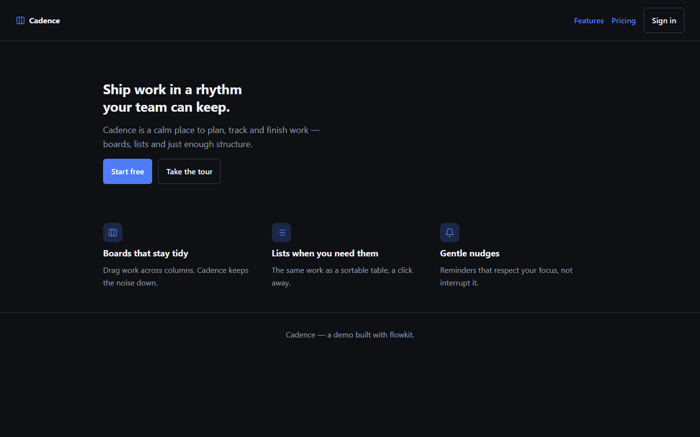
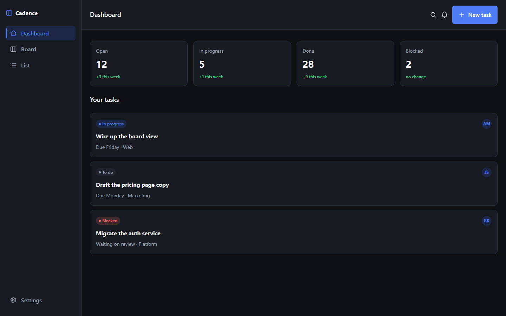
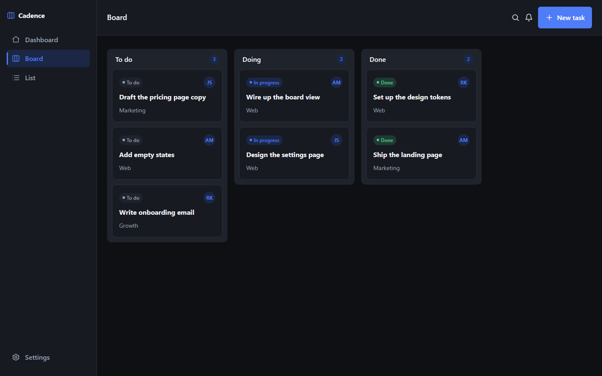
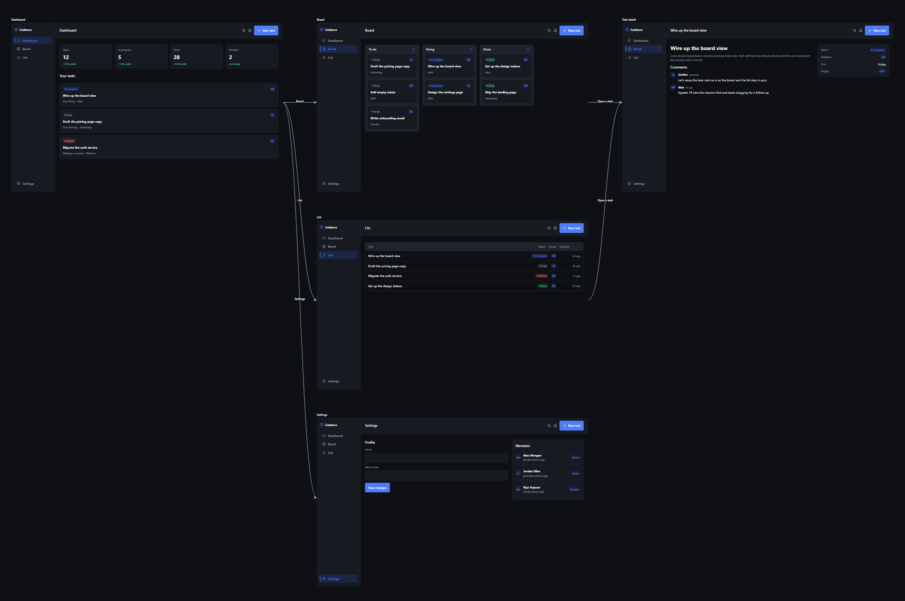
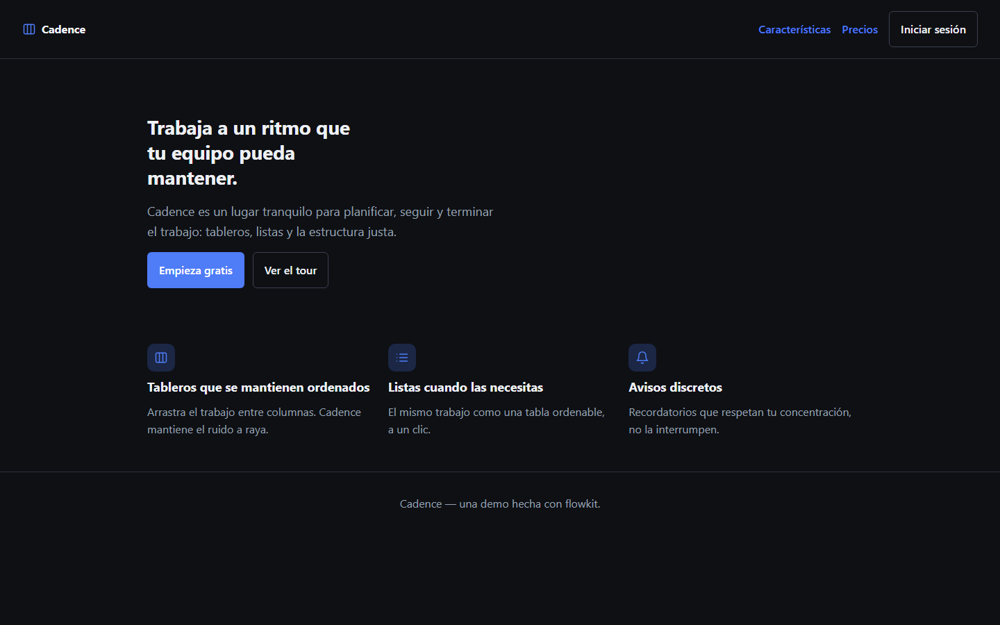

# Cadence — the flowkit demo

A small but complete SaaS design, built entirely through flowkit's MCP tools. It
is here so you can clone the repo and see, in one project, most of what flowkit
does: a design system, a registry of composable parts, real screens that use
them, a screen-flow on the canvas, and two languages.

Cadence is a fictional task manager — a marketing site (landing, pricing), an
auth flow (sign in, sign up), and the app itself (dashboard, board, list, task
detail, settings).





## Open it

From the repo root:

```bash
bun install
bunx @combycode/flowkit --workspace examples/cadence
```

The canvas opens in your browser. Switch the theme (dark / light) and the locale
(English / Español) in the toolbar; every screen follows, because they are the
same tokens and strings the design is built from.

To see it without running anything, open the exported one-file viewer (generated
into `exports/viewer` by `export_viewer`, or regenerate it yourself — see below).

## What it shows

- **A design system** — colour, type, spacing and radius tokens in a dark and a
  light theme, plus an icon sprite. The kit pages (`kit-foundation`,
  `kit-elements`, …) are generated from the registry and cannot drift from it.
- **A registry, every tier** — elements (button, pill, avatar, tag, icon,
  input, checkbox, link), components (task-card, stat-card, list-row, comment,
  member-row, feature, tier, nav-item), containers (sidebar, topbar,
  board-column, modal) and layouts (app / marketing / auth shells).
- **Variants** — a class variant (button quiet/danger), attribute and **markup**
  variants (the sidebar nav's active state carries its own accent bar), and a
  container variant (the sidebar's collapsed `mini`).
- **Composition** — screens are drawn from the registry with `<x-part>`,
  `<x-slot>` and `<x-fill>`; nothing is copied, so the kit shows the same parts
  the screens do.
- **A screen flow** — the screens sit on the canvas in two groups (marketing &
  auth, the app) with the paths between them labelled.
- **Text and translation** — every visible string carries a key; the public
  pages and the app chrome are fully translated to Spanish, with sample task
  data falling back to English as user content would.




## How it was built

Not by hand-editing the JSON — by driving the real MCP server exactly as an
agent would. [`build.ts`](build.ts) is that script, and it is re-runnable:

```bash
bun run examples/cadence/build.ts all      # the whole project, in order
bun run examples/cadence/build.ts board    # just one phase
```

The phases run foundation → elements → components → containers → layouts →
screens → flow → strings → locale, and each is idempotent enough to replay.

## Regenerate the exports

```bash
bunx @combycode/flowkit --workspace examples/cadence   # then, from the tools, or:
bun run tools/mcp-call.ts --workspace examples/cadence export_viewer full=true project=cadence --wait
bun run tools/mcp-call.ts --workspace examples/cadence export_spec project=cadence --wait
```

They land in `exports/`, which is git-ignored.
